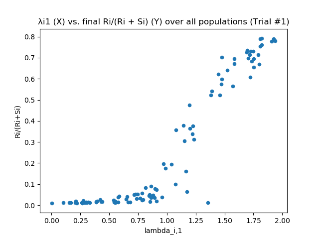
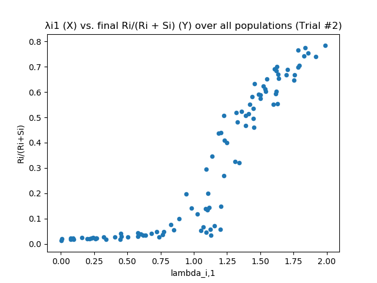
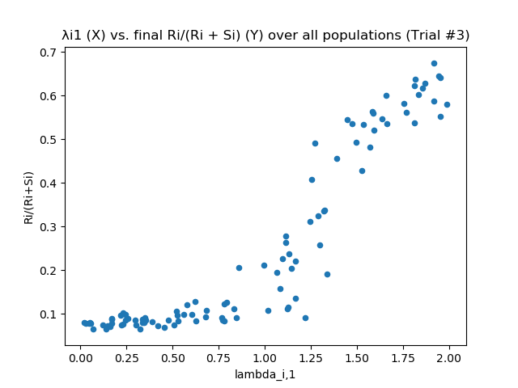
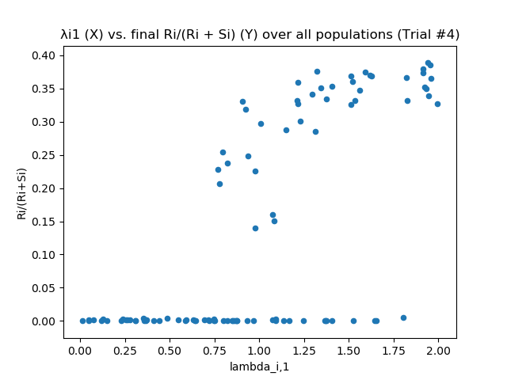

### Results

This is an implementation of the Susceptible, Infected, Recovered model for infectious disease.

We will use a simple SIR model here to examine issues of how one might slow COVID-19 infections.
A Continuous Time Markov Model is implemented, such that events occur with $X \sim Exp(\lambda_i)$ for event $i$.

Simplest Case:

- We are given the simple assumption of N people, split into 3 populations $(S,I,$ and $R)$.
- No reinfection.
- Each infected person contacts $\lambda_1$ persons per unit time
- Of $\lambda_1$ persons, $S/N$ are infectious.
- --> Total rate of new people infected per unit time is λ1*I*(S/N)
- infected people recover at $\lambda_2$, so overall recovery rate is $\lambda_2I$.

***

Our, More General Case:

- People are from different countries affecting $\lambda_1$ differently, with different ways of controlling immigration.
- Assume $m$ countries each with population $N_i = |S_i| + |I_i| + |R_i|$, with
  - infections at rate $\lambda_{i1}Ii\frac{S_i}{N_i}$
  - recovery at rate $\lambda_{i2}I_i$
  - Also, assume inter-country migration at $\lambda_{i3}$, for a rate of movement fooor countries $i \to j$ at $\lambda_{i3}N_i$

We will vary parameters $\lambda$ to understand how this Markov Model behaves.
***
Assumptions:
- $\lambda_{i2}, \lambda_{i3}$ are population-invariant, but $\lambda_{i1}$ varies by population (policy dependent).
- Specifically, assume $\lambda_{i1} \sim U[0,\lambda_1^*]$ for some maximum given value $\lambda_1^*$.
- Assume $m$ populations each initially with constant $N_i=N$ people.
- Initially, each population is split into $S_i=N-k,\ I_i = k,$ and $R_i = 0$, for arguments $m,N,k$.
***

Implementation details:
- Command-line Arguments: $m,N,k,\lambda_1^*,\lambda_2,\lambda_3$
- Returns: prints and writes line for each
  - $\lambda_{11} R_1/(R_1+S_1)$
  - $\lambda_{21} R_2/(R_2+S_2)$
  - ...
  - $\lambda_{m1} R_m/(R_m + S_m)$

    Also plots $\lambda_{i1}$ versus the final $R_i/(R_i+S_i)\ \forall$ populations.

The script will terminate when $\sum_iI_i = 0$, for $1...i...m$.

Example: For $m=100,N=1000,k=10,\lambda_1 = 2, \lambda_2 = 1, \lambda_3 = 0$, run
- `SRI_discrete.py --m 100 --n 1000 --k 10 --l1 1 --l2 1 --l2 0`

